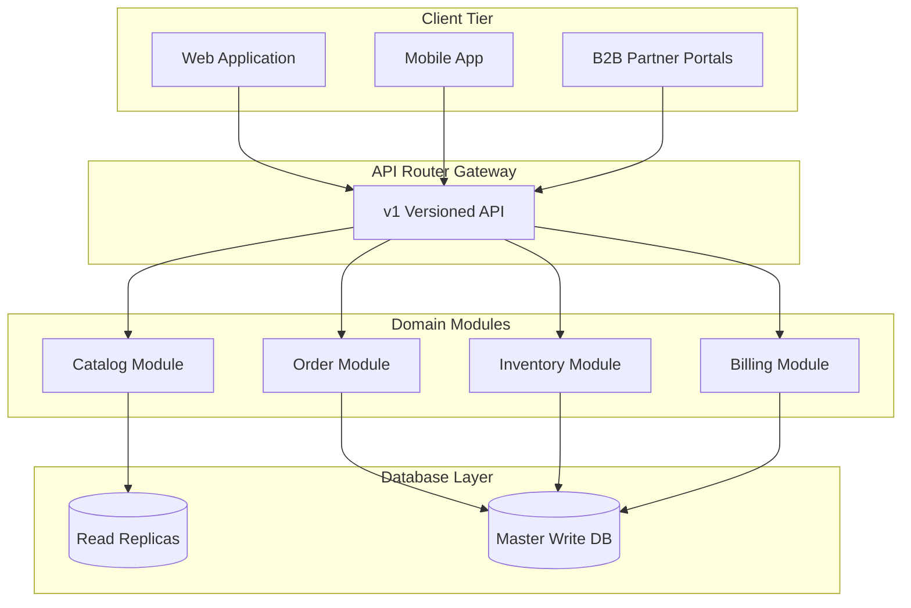
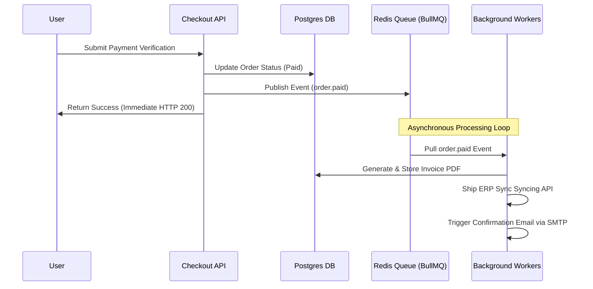

# JK Timbers: Enterprise Platform Evolution Strategic Reports
**Phase 9 — Enterprise Scaling, Platform Ecosystem Expansion & Long-Term Technology Evolution**

---

## 1. Enterprise Scalability Assessment

### Current Architecture Overview
The platform currently utilizes a standard Next.js App Router Monolith backed by PostgreSQL and Prisma ORM. While this monolithic architecture provides high speed of development and low transactional latency, scaling past $10M+ in annual GMV requires addressing key architectural bottlenecks.

### Structural Bottlenecks
* **Single-DB Bottleneck**: All tables (catalog, orders, billing, user data) reside in a single PostgreSQL database instance. Write amplification from high-frequency cart syncs, session records, and audit logs threatens to saturate I/O capacity.
* **Process Caching**: Rate limits and temp tokens are stored inside single-process memory. If the platform scales horizontally across multiple servers or serverless regions, these limits will split, leading to inconsistent security behaviors.
* **Tight Synchronous Operations**: Billing, payment processing, invoice generation, and CRM-like customer updates occur synchronously in web request handlers. Under heavy load, response times degrade, and database locking cascades.

---

## 2. Infrastructure Scaling Strategy

### Autoscaling Computes
Deploy the Next.js server container across a managed cluster (e.g. AWS ECS on Fargate, GCP Cloud Run, or Kubernetes). Computes will scale horizontally based on CPU utilization and request concurrency.
* **Scale-up threshold**: 70% CPU load sustained for 2 minutes.
* **Scale-down threshold**: <30% CPU load sustained for 15 minutes.

### Read/Write Database Separation
To scale PostgreSQL, database reads will be directed to read replicas. Prisma will route read queries (e.g., product searches) to replicas, reserving the master writer node for checkouts, inventory adjustments, and user creation.

### Database Sharding & Partitioning Readiness
* **Partitioning**: Partition historical orders and audit tables (like `PaymentEvent`, `InventoryTransaction`) by month/year to prevent indexing bottlenecks on tables with millions of rows.
* **Sharding**: Ready the database for B2B sharding by tenant or contractor ID if multi-tenant dealer operations are introduced in the future.

---

## 3. Modular Architecture Evolution Plan



### Decoupling Plan
We will enforce logical domain separation inside our codebase using bounded contexts before splitting into physical microservices.
1. **Catalog Module**: Owns products, variants, media, and search. Highly read-optimized, heavily cached.
2. **Order Module**: Controls checkout verification, states, and ordering queues. Optimized for transactional consistency.
3. **Inventory Module**: Reconciles warehouse stock under serializable transactions.
4. **Billing Module**: Handles payment webhooks, gateways, and invoice generation.

---

## 4. Async/Event Architecture Explanation

To improve operational decoupling, events will drive the secondary actions of the application.



* **Retry Mechanism**: Failed jobs (e.g., ERP endpoint down) are retried using exponential backoffs up to 5 times.
* **Idempotency**: All consumers use database transaction locks (`paymentAttempt` ID / transaction ID checking) to prevent processing duplicate webhook/queue events.

---

## 5. API Evolution Strategy

To grow the partner ecosystem, our APIs must remain stable and secure:
* **Versioning Route**: We introduce `/api/v1/` routes. Major breaking changes increment the API version (e.g. `/api/v2/`).
* **Developer Safe Contracts**: Document APIs using OpenAPI specification schemas. Use Zod parsing in route handlers to enforce strict types.
* **Rate-limiting**: API keys are generated for external vendors, rate-limited via Redis sliding-window limiters to 1000 requests/hour.
* **Outbound Webhooks**: Allow partner logistics and contractor systems to subscribe to order events. Webhooks are delivered via our `webhookDispatchService` with signature verification.

---

## 6. Integration Architecture Strategy

External business integrations must be decoupled via adapter patterns:

```
[Domain Services] 
        │
        ▼ (Standard Interfaces)
[erpAdapter / logisticsAdapter]
        │
  ┌─────┼──────────────┐
  ▼     ▼              ▼
[SAP] [Zoho] [Delhivery / Carrier APIs]
```

### Decoupling Rules
1. **Interface Binding**: All service calls target the generic interface (e.g., `LogisticsAdapter`) rather than carrier-specific libraries.
2. **Mocking Fallbacks**: Out-of-the-box local mock classes verify application workflows without network calls.
3. **Error Isolation**: Third-party errors do not crash caller services; exceptions are swallowed, logged, and queued for retry.

---

## 7. Security Maturity Assessment

### Governance Assessment
* **NextAuth & RBAC**: The current NextAuth.js structure is solid, employing JWT session verification and a 6-level role hierarchy (`SUPER_ADMIN` to `USER`).
* **Security Headers**: Standard headers (HSTS, CSP, X-Frame-Options) are configured.

### Action Plan
* **Prune Weaknesses**: Increase password length validation checks from 6 to 10 characters.
* **CSRF Shielding**: Integrate CSRF token validation on mutation endpoints.
* **Zero-Trust**: Add API token keys for internal service-to-service calls.
* **Automated Scans**: Integrate Snyk/OWASP dependency checkers in CI/CD pipeline.

---

## 8. Engineering Team Scalability Plan

To scale from 1 developer to multiple teams, we will enforce strict repository rules:
* **ADR (Architecture Decision Records)**: Any major design changes must be documented under `docs/adrs/` and reviewed.
* **Workspace Boundaries**: Enforce module boundaries via TypeScript path aliases and ESLint rules preventing cross-module imports (e.g. repositories should never import controllers).
* **Onboarding Tooling**: Maintain Docker-compose environment setups to allow developers to build and run the system locally in one command:
  ```bash
  docker-compose up --build
  ```

---

## 9. Operational Automation Strategy

Reduce administrator overhead via automation:
* **Automated Maintenance**: Weekly CRON executes our database maintenance script to prune expired logs and abandoned carts.
* **Kubernetes Probes**: Deploy `/api/v1/health` checks for Kubernetes/DevOps auto-restarts on service hangs.
* **Auto-Alerts**: Configure Sentry alerting groups to ping Slack/Teams channels on uncaught exceptions.

---

## 10. Multi-Platform & Omnichannel Readiness

To prepare for future mobile applications, contractor tablets, and dealer portals:
* **Session Decoupling**: Build NextAuth JWT-compatible endpoints so mobile apps can authenticate and preserve user tokens.
* **UI/Data Separation**: UI templates should reside strictly client-side. The API layer returns pure JSON payloads to support mobile, web, and external ERP integration layers alike.

---

## 11. Cost Optimization & Infrastructure Efficiency

* **Compute Costs**: Set autoscaling groups to scale Fargate/FaaS containers to zero during off-peak hours (e.g. 1 AM to 5 AM local time).
* **Database Caching**: Frequently hit endpoints (like Category and product catalog listings) will serve responses out of the Redis cache, avoiding expensive database queries.
* **Asset Storage**: Optimize media by pushing uploads through an image CDN (e.g., Cloudinary or Cloudflare Images) to serve compressed WebP/AVIF formats dynamically.

---

## 12. Technical Debt Management Strategy

* **Regular Upgrades**: Bi-monthly dependency update cycles to keep next, prisma, and node secure.
* **Archiving Strategy**: Migrate logs and old audits (from database tables) to cold storage (e.g. AWS S3 Glacier) annually to prevent database bloat.
* **Refactoring Budgets**: Allocate 20% of every development sprint to paying down tech debt identified by code linters.

---

## 13. Long-Term Architecture Roadmap

```
Phase 9.1: Caching & Dockerization 
  (Local Containerization, Redis Client, Rate-Limiting Upgrades)
           │
           ▼
Phase 9.2: Async Architecture 
  (Queue processing, Webhooks dispatch, Background invoicing)
           │
           ▼
Phase 9.3: External Integration 
  (ERP & Logistics Adapter, Analytics Pipeline, API v1 routes)
```

---

## 14. 3-5 Year Engineering Evolution Plan

```
Year 1: Scale Web Monolith 
  (Implement caching, read replicas, async job processors)
           │
           ▼
Year 2: API Gateway & External Ecosystem 
  (Expose developer APIs, B2B contractor integrations, mobile app release)
           │
           ▼
Year 3+: Transition to Microservices 
  (Split Billing, Catalog, and Orders into distributed ECS microservices)
```

---

## 15. Enterprise Growth Readiness Assessment

The platform is **READY** to support enterprise growth. 
By introducing local Dockerization, Redis caching, event-driven queues, adapter patterns for external ERPs, API v1 health checks, and ADR systems, the platform possesses the operational stability, speed, and horizontal scaling capabilities required to support high-throughput commercial business.
